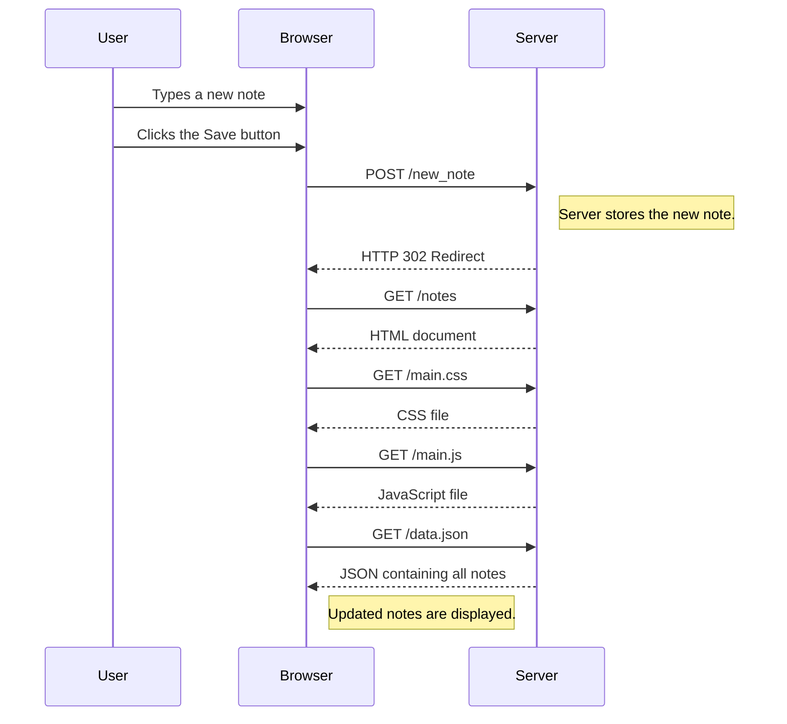

```mermaid
sequenceDiagram

    %% Käyttäjä kirjoittaa uuden muistiinpanon.

    participant User
    participant Browser
    participant Server

    User->>Browser: Types a new note
    User->>Browser: Clicks the Save button

    %% Selain lähettää uuden muistiinpanon palvelimelle.
    Browser->>Server: POST /new_note

    Note right of Server: Server stores the new note.

    Server-->>Browser: HTTP 302 Redirect

    %% Selain lataa sivun uudelleen.
    Browser->>Server: GET /notes
    Server-->>Browser: HTML document

    %% Selain hakee tarvittavat tiedostot.
    Browser->>Server: GET /main.css
    Server-->>Browser: CSS file

    Browser->>Server: GET /main.js
    Server-->>Browser: JavaScript file

    Browser->>Server: GET /data.json
    Server-->>Browser: JSON containing all notes

    Note right of Browser: Updated notes are displayed.
```