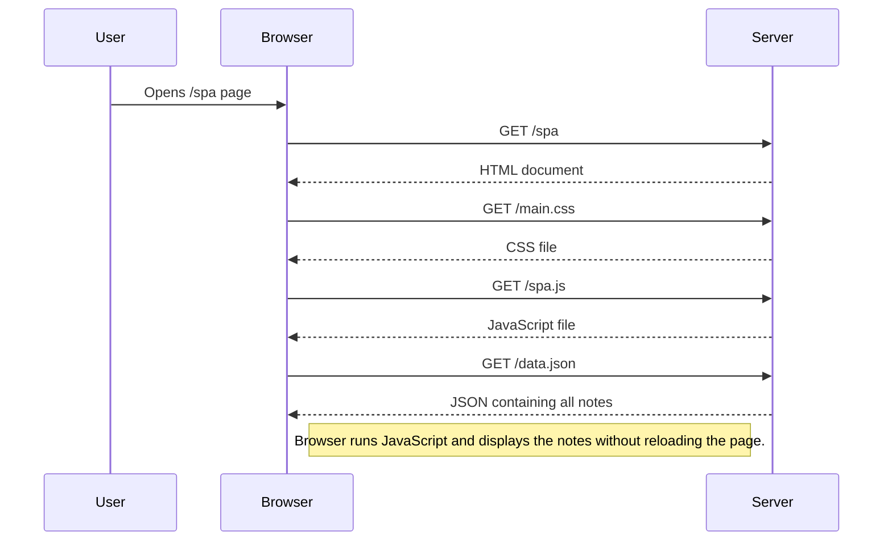

```mermaid
sequenceDiagram

    %% Käyttäjä avaa SPA-sivun selaimessa.

    participant User
    participant Browser
    participant Server

    User->>Browser: Opens /spa page

    %% Selain pyytää SPA-sivun palvelimelta.
    Browser->>Server: GET /spa
    Server-->>Browser: HTML document

    %% Selain hakee tyylitiedoston.
    Browser->>Server: GET /main.css
    Server-->>Browser: CSS file

    %% Selain hakee JavaScript-tiedoston.
    Browser->>Server: GET /spa.js
    Server-->>Browser: JavaScript file

    %% JavaScript hakee muistiinpanot JSON-muodossa.
    Browser->>Server: GET /data.json
    Server-->>Browser: JSON containing all notes

    Note right of Browser: Browser runs JavaScript and displays the notes without reloading the page.
```