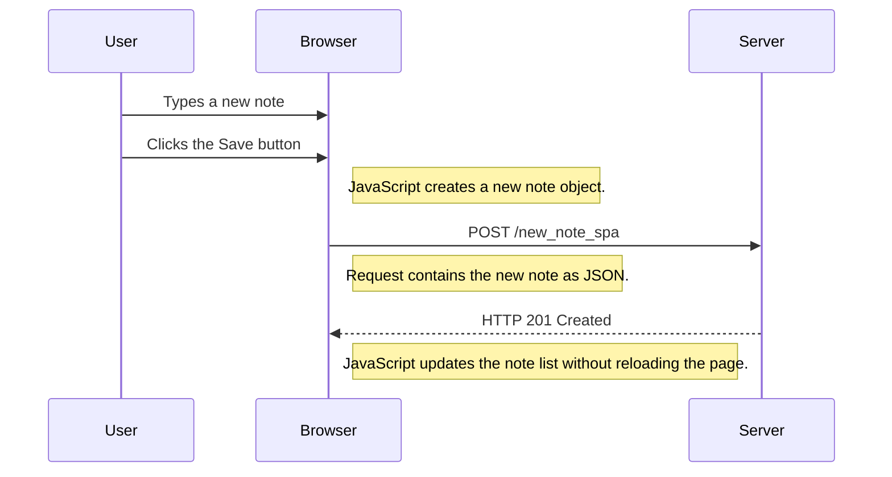

```mermaid
sequenceDiagram

    %% Käyttäjä kirjoittaa uuden muistiinpanon SPA-versiossa.

    participant User
    participant Browser
    participant Server

    User->>Browser: Types a new note
    User->>Browser: Clicks the Save button

    %% JavaScript luo uuden muistiinpanon.
    Note right of Browser: JavaScript creates a new note object.

    %% Selain lähettää uuden muistiinpanon palvelimelle.
    Browser->>Server: POST /new_note_spa
    Note right of Browser: Request contains the new note as JSON.

    Server-->>Browser: HTTP 201 Created

    %% Selain päivittää näkymän ilman sivun uudelleenlatausta.
    Note right of Browser: JavaScript updates the note list without reloading the page.
```